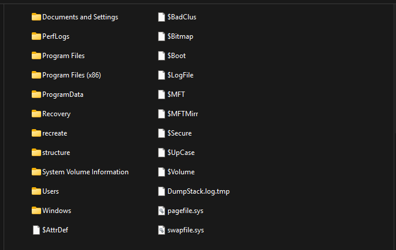
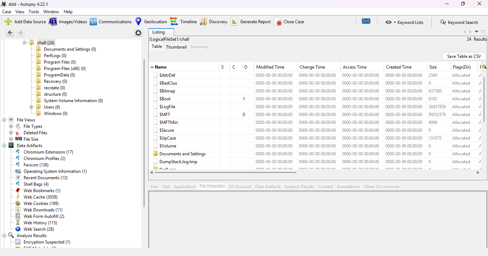
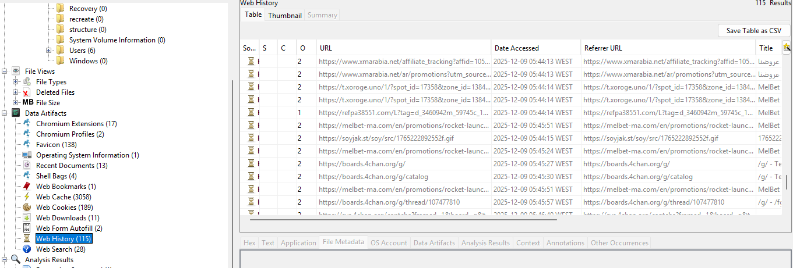
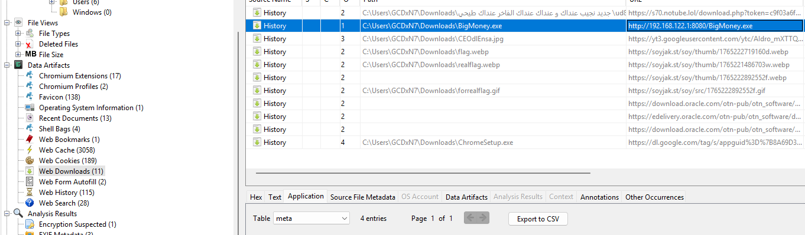
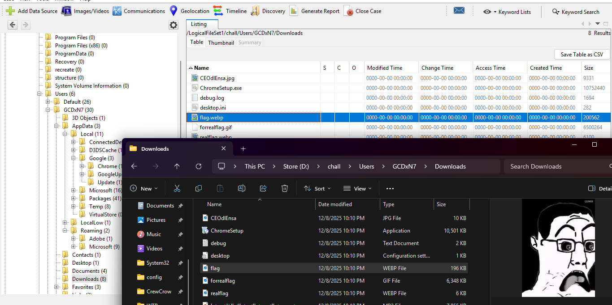
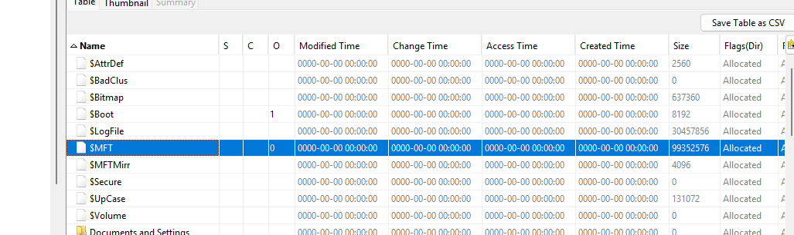
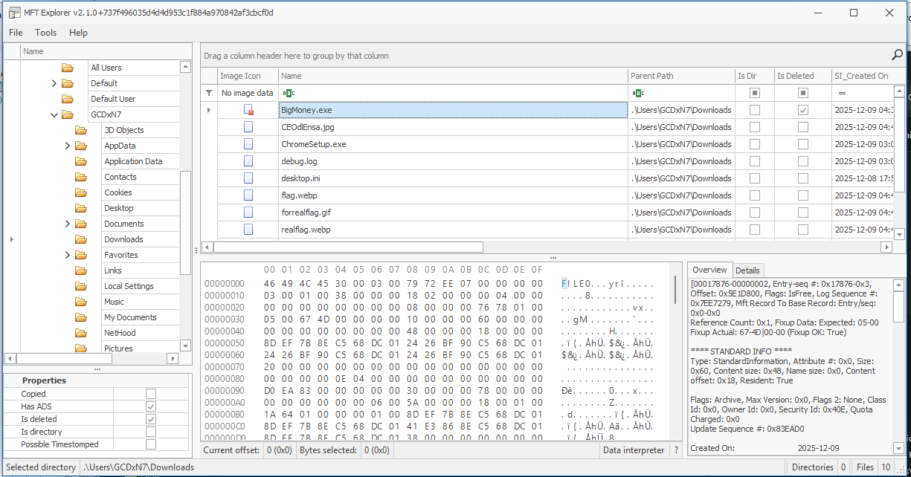
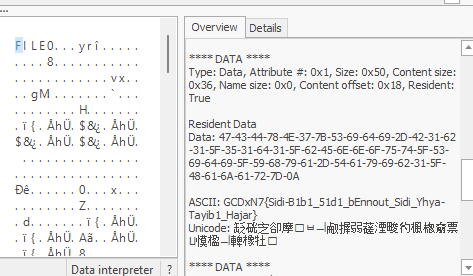

We were provided with what appears to be a collection of Windows logical files rather than a full disk image. Since the data is already extracted at the filesystem level, the correct approach is to load it into Autopsy, By ingesting the files this way, we can still analyze key forensic artifacts such as registry hives, event logs, prefetch files, browser data, and user profile contents, which are sufficient for investigating user activity

The Autopsy browser history module reveals numerous seemingly random visited URLs. However, one entry stands out: `192.168.122.1:8080`

as for Autopsy Downloads module it shows multiple files downloaded with the name `flag`, it also reveals a downloaded executable named `BigMoney.exe` originating from the previously identified suspicious address.

examination of the downloaded files shows that the items containing `flag` in their names are decoys and do not contain the real flag. Notably, `BigMoney.exe` is no longer present on disk, indicating that it was deleted after being downloaded. Deletion in NTFS does not immediately erase file metadata; instead, it removes directory references while leaving records behind until they are overwritten.

To trace the deleted executable, we must analyze the **$MFT (Master File Table)**. The $MFT is the core NTFS metadata structure that maintains a record for every file and directory on the volume. Each file is represented by an MFT entry containing attributes such as filename, timestamps, size, and pointers to data blocks.

NTFS stores file data in two ways:

- **Resident files**: For small files, the file content is stored directly inside the MFT entry itself. If such a file is deleted, its entire content may still be recoverable directly from the MFT record, provided it has not been reused.
    
- **Non-resident files**: For larger files, the MFT entry only contains runlists pointing to clusters elsewhere on disk where the file data is stored. Even after deletion, these runlists and associated metadata can persist, allowing investigators to identify the file’s former location and potentially recover its contents if the clusters have not been overwritten.

We used MFTExplorer to load and parse the $MFT table. By navigating to the Downloads directory, we were able to confirm that `BigMoney.exe` had indeed been deleted. Despite the deletion, the corresponding MFT record was still intact.
Crucially, the file was identified as a resident file, meaning its entire contents were stored directly within the MFT entry itself rather than in external disk clusters. As a result, the full file content remained accessible within the **$DATA** attribute of the MFT record.
Inspecting the $DATA section revealed the embedded flag

**FLAG: GCDxN7{Sidi-B1b1_51d1_bEnnout_Sidi_Yhya-Tayib1_Hajar}**
