In this challenge, you are only provided with a Wireshark capture. After opening it, you will observe a large volume of diverse traffic. The first step is to identify cleartext protocols, such as HTTP and FTP...
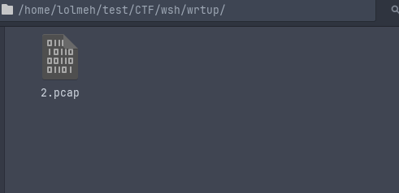
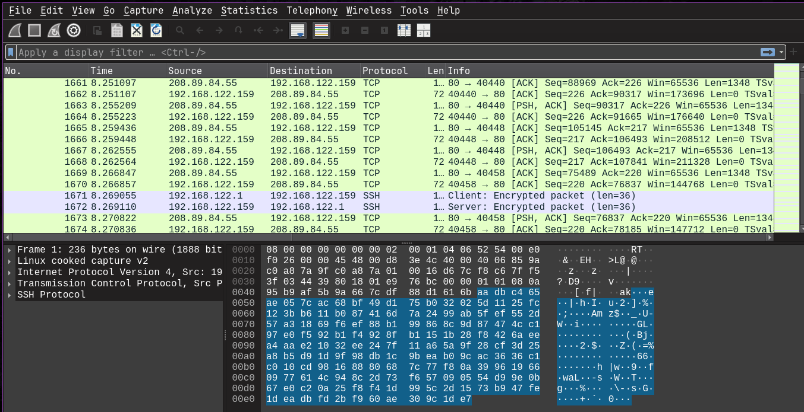

Looking for HTTP traffic did not yield any results; however, FTP appears promising.

HTTP filter:

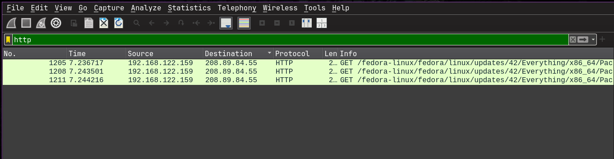

FTP filter:

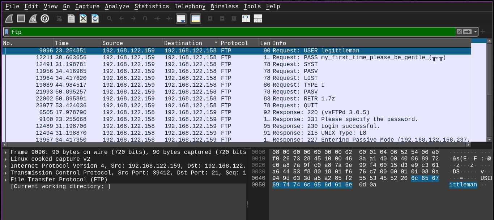
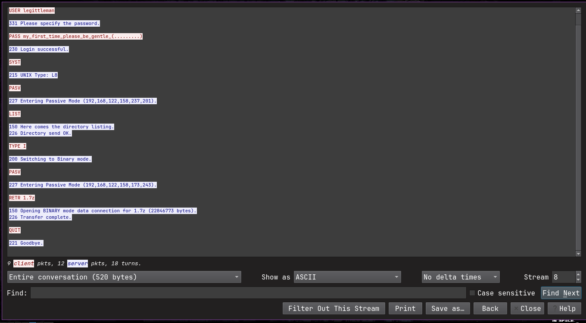

Following the FTP stream in the capture reveals that a file named `1.7z` was transferred. By analyzing the stream, you can see the FTP commands and responses, including the `RETR` command that indicates the file upload or download
After that, we export the transferred file from the capture for further analysis.

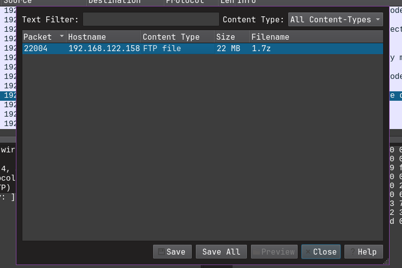

The exported file appears to be a 7z archive containing another PCAP file named `1.pcap`. Opening this inner PCAP reveals additional network traffic 

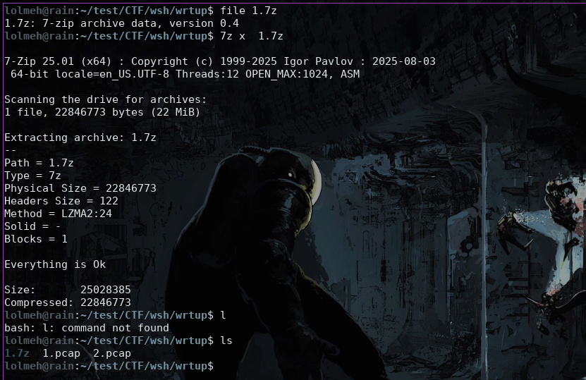

The challenge is titled _Ping Pong_, which serves as a hint to focus on ICMP traffic. Based on this, the next step is to filter and analyze ICMP packets in the capture.

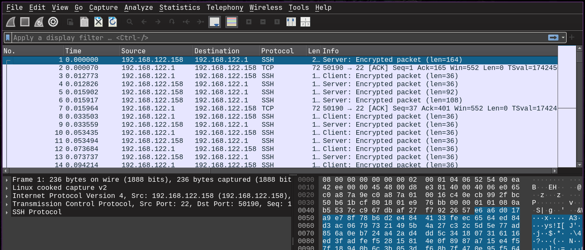
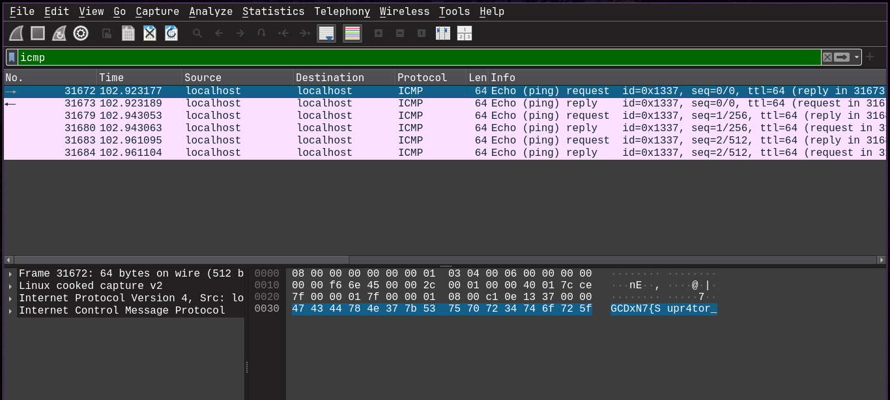

We can extract the ICMP packets using `tshark` and decode their payload from hexadecimal. Analysis shows that the ICMP reply packets carry the same data as the echo requests, explaining the duplicates. After removing the duplicates

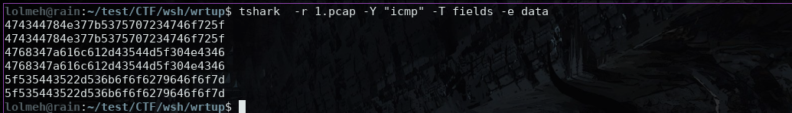

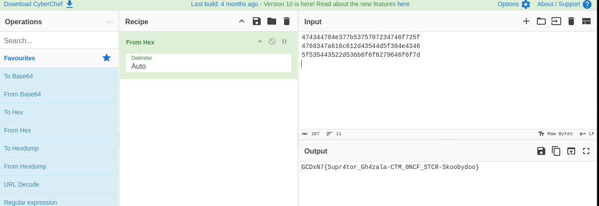

**FLAG: GCDxN7{Supr4tor_Gh4zala-CTM_0NCF_STCR-Skoobydoo}**
