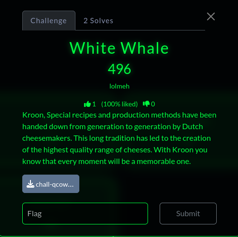
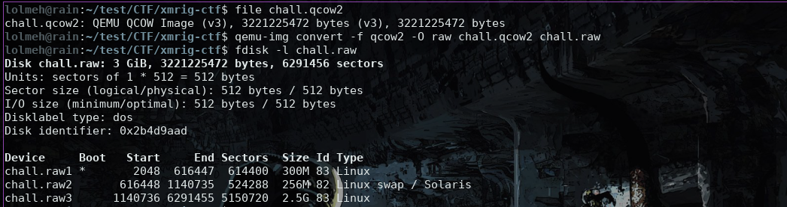
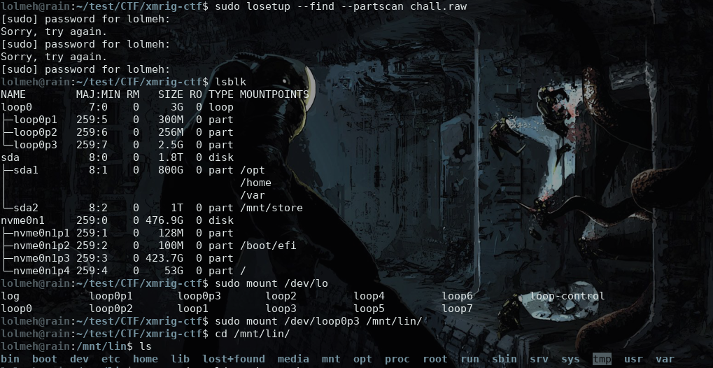
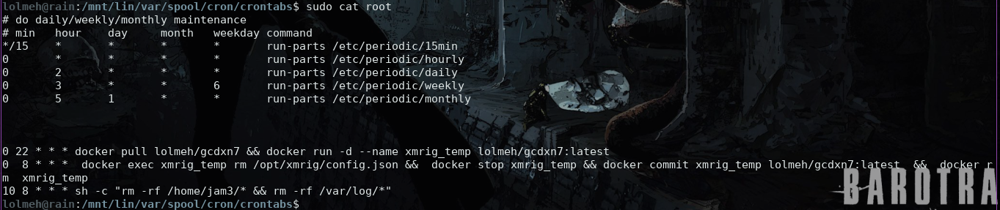
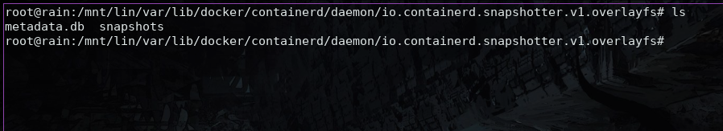
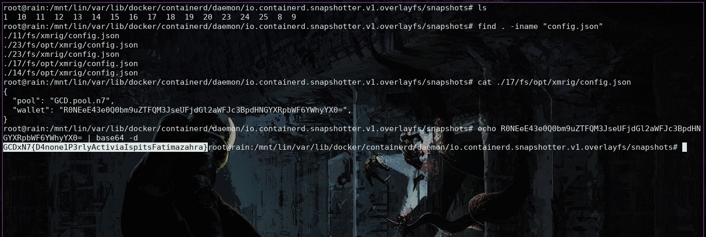

We are provided with a QCOW2 disk image containing a Linux filesystem. The correct initial step is to convert the image to raw format, since raw images are easier to inspect with standard Linux tools. After conversion, the raw image can be examined to identify its partition layout and then mounted read-only, allowing direct analysis of the filesystem contents (such as system configuration, cron jobs, logs, and binaries) without modifying the evidence.

The challenge description hints at something related to cron, so it is logical to start by examining cron-related activity first.

persistence is achieved through root’s crontab. In addition to normal maintenance jobs, the cron configuration pulls a Docker image (`lolmeh/gcdxn7`) every night, runs it as a container named `xmrig_temp`, and later stops it, deletes its configuration, commits the container back into the same image tag, and removes it, effectively creating a self‑modifying image. A final cron job wipes user files and system logs, indicating deliberate anti‑forensic behavior. Since the online Docker image is no longer available, the correct next step is to analyze local Docker artifacts inside the filesystem, particularly the Docker storage directories and image layers under `/var/lib/docker`, where remnants of the miner and its configuration are likely preserved.persistence is achieved through root’s crontab. In addition to normal maintenance jobs, the cron configuration pulls a Docker image (`lolmeh/gcdxn7`) every night, runs it as a container named `xmrig_temp`, and later stops it, deletes its configuration, commits the container back into the same image tag, and removes it, effectively creating a self‑modifying image. A final cron job wipes user files and system logs, indicating deliberate anti‑forensic behavior. Since the online Docker image is no longer available, the correct next step is to analyze local Docker artifacts inside the filesystem, particularly the Docker storage directories and image layers under `/var/lib/docker`, where remnants of the miner and its configuration are likely preserved.

Docker uses a layered filesystem (commonly `overlay2`) where each image and container is built from stacked read‑only layers plus a writable layer. When a container runs, any file it creates or modifies such as `/opt/xmrig/config.json` is written into that container’s writable layer, not the base image. When `docker commit` is executed, this writable layer is frozen and saved as a new image layer on disk under `/var/lib/docker/containerd/daemon/io.containerd.snapshotter.v1.overlayfs`  (on alpine should be in `/var/lib/docker/overlayfs` on other Distros. 
As a result, even if the container is later stopped, removed, or the online image is deleted, the filesystem changes, including `config.json`, often still exist inside these stored layers, making them recoverable through direct filesystem analysis.

We can simply use `find` to search the filesystem for files named `config.json`. Inspecting the recovered file shows that it contains a Base64‑encoded string, which, once decoded, reveals the flag.

**FLAG: GCDxN7{D4none1P3rlyActiviaIspitsFatimazahra}**
